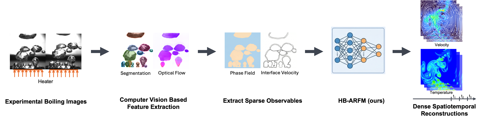
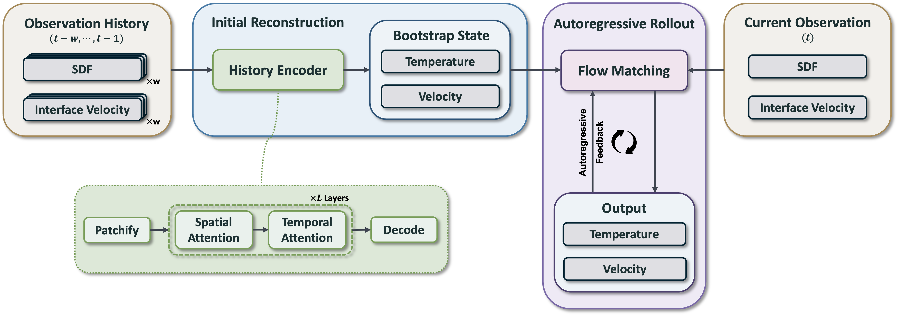

<h1 align="center" style="margin:0;">
    HB-ARFM
</h1>

<h3 align="center" style="margin: 0; margin-top: 0;">
    History-Bootstrapped Flow Matching for Inverse Boiling Reconstruction
</h3>

<p align="center" style="margin: 0; margin-top: 0;">
    Xianwei Zou · Sheikh Md Shakeel Hassan · Arthur Feeney · Aparna Chandramowlishwaran
</p>

<p align="center">
    <a href="https://arxiv.org/abs/2606.00349"></a>
    <a href="https://arxiv.org/pdf/2606.00349"></a>
    <a href="https://huggingface.co/datasets/hpcforge/BubbleML_2"></a>
</p>

<p align="center">
    Official implementation of the ICML 2026 paper
    <a href="https://arxiv.org/abs/2606.00349"><i>History-Bootstrapped Flow Matching for Inverse Boiling Reconstruction</i></a>.
</p>

<figure>
    
    <div align="center">
        <figcaption><b>An example pipeline of spatiotemporal boiling dynamics reconstruction from high-speed imaging.</b> Sequential high-speed images are processed through segmentation and optical flow to extract the phase field and interface velocity. These extracted observations condition our proposed HB-ARFM model, which then outputs full spatiotemporal predictions of velocity and temperature fields, enabling complete multiphase fluid dynamics reconstruction from raw imaging data alone.</figcaption>
    </div>
</figure>
<br>

---

## Overview

Reconstructing full spatiotemporal fields from partial observations is a fundamental inverse
problem in scientific machine learning. When observations are incomplete, the inverse problem is
ill-posed: even when the underlying PDE dynamics are Markovian in the full state, partial
observation operators induce a **non-Markovian posterior** that cannot be resolved from a single
timestep.

We propose **History-Bootstrapped Autoregressive Flow Matching (HB-ARFM)**, a unified model for
spatiotemporal inverse reconstruction under partial observability. Observation history bootstraps
the initial reconstruction via conditional flow matching, reducing ambiguity. The same conditional
transport model is then applied autoregressively, conditioning on both new observations and past
predictions to propagate the reconstruction forward in time.

We evaluate the method on **boiling dynamics reconstruction**, recovering full velocity and
temperature fields from interface geometry and motion alone.

## Model: History-Bootstrapped ARFM

<figure>
    
    <div align="center">
        <figcaption><b>History-Bootstrapped ARFM.</b> The model combines a history encoder processing temporal sequences with an FM UNet for both initial and autoregressive (AR) reconstructions. The FM UNet predicts the full spatiotemporal fields. The green path shows the initial reconstruction, while the red feedback loop enables sequential reconstruction with data assimilation.</figcaption>
    </div>
</figure>
<br>

HB-ARFM operates in two stages using a single shared conditional flow matching model:

1. **History-conditioned bootstrap reconstruction** — a temporal history encoder aggregates an
   observation window (SDF + interface velocity) to estimate the first hidden state, which then
   conditions a flow matching velocity field that transports Gaussian noise to the posterior over
   the full state.
2. **Autoregressive rollout** — the same flow matching model propagates the solution forward in
   time, conditioning on new observations and the model's own previous predictions (data
   assimilation), avoiding the cold-start problem of standard autoregressive models.

The reference configuration lives in
[`bubblefusion/config/model_cfg/flow_matching_ar_bootstrap.yaml`](bubblefusion/config/model_cfg/flow_matching_ar_bootstrap.yaml).

---

## Repository structure

```
Bubblefusion/
├── bubblefusion/                 # Core Python package
│   ├── config/                   # Hydra configs
│   │   ├── default.yaml          # Top-level config (compose entry point)
│   │   ├── data_cfg/             # Dataset configs (pool/flow boiling)
│   │   ├── model_cfg/            # Model configs (HB-ARFM + baselines)
│   │   ├── optim_cfg/            # Optimizers (adam, adamw, lion)
│   │   ├── scheduler_cfg/        # LR schedulers (cosine, cosine_warmup)
│   │   └── task_cfg/             # Inverse task definitions
│   ├── data/bubbleml.py          # BubbleML dataset classes + normalization
│   ├── models/                   # Model + LightningModule implementations
│   ├── modules.py                # Shared network building blocks
│   └── utils/                    # Noise models, helpers
├── scripts/                      # Training, inference, metrics, plotting
│   ├── train.py                  # Main training entry point (Hydra)
│   └── comprehensive_inference_task123.py  # Main inference entry point
├── env/                          # Conda / pip environment files
├── media/                        # Figures
├── normalization_stats.json      # Precomputed stats (subcooled pool boiling)
└── normalization_stats_saturated.json  # Precomputed stats (saturated pool boiling)
```


### Inverse tasks

| Task config | Conditioning (observations) | Targets |
|---|---|---|
| `temperature_from_sdf` (Task 1) | SDF (interface geometry) | temperature |
| `velocity_from_interface` (Task 2) | SDF + interface velocity | velocity (`velx`, `vely`) + temperature |

---

## Installation

The package targets **Python 3.10** and **PyTorch 2.5.1**. Pick the environment file that matches
your hardware.

### Option A — Conda (recommended)

```bash
# GPU (CUDA 12.4)
conda env create -f env/bubblefusion_gpu.yaml
conda activate bubblefusion

# or CPU-only
conda env create -f env/bubblefusion_cpu.yaml
conda activate bubblefusion

# install this package (editable)
pip install -e .
```

### Option B — pip / virtualenv

```bash
python3.10 -m venv .venv
source .venv/bin/activate
pip install -r env/requirements.txt
pip install -e .
```

Key dependencies (pinned in `env/`): `torch==2.5.1`, `torchvision==0.20.1`, `numpy==2.2.5`,
`h5py==3.14.0`, `lightning==2.5.2`, `hydra-core==1.3.2`, `wandb==0.21.1`, `timm==1.0.19`,
`einops==0.8.1`, `opencv-python==4.12.0.88`, `matplotlib==3.10.5`, `lion-pytorch==0.2.3`,
`pandas==2.3.3`.

---

## Dataset access

We train and evaluate our models using the **BubbleML** dataset, hosted on Hugging Face:
**https://huggingface.co/datasets/hpcforge/BubbleML_2**.

The main experiments use the **`PoolBoiling-Subcooled-FC72-2D`** subset (subcooled pool boiling of
FC-72); generalization experiments use the flow-boiling subset.

Download the relevant subset and point `data_home` at the directory that contains the subset
folders, e.g.:

```
$DATA_HOME/
└── PoolBoiling-Subcooled-FC72-2D/
    ├── Twall_86.hdf5
    ├── Twall_88.hdf5
    └── ...
```

Each trajectory is an HDF5 file with fields `temperature`, `velx`, `vely`, `dfun` (signed distance
function), and `massflux`, plus a sibling `.json` file with fluid parameters. The exact train/test
splits used in the paper are defined in
[`bubblefusion/config/data_cfg/poolboiling_subcooled.yaml`](bubblefusion/config/data_cfg/poolboiling_subcooled.yaml).

---

## Training

Training is driven by [Hydra](https://hydra.cc/). The composition root is
[`bubblefusion/config/default.yaml`](bubblefusion/config/default.yaml), and run-level settings
(`log_dir`, `seed`, `nodes`, `devices`, `max_epochs`, `batch_size`, `use_wandb`, `data_home`) are
supplied on the command line.

Train **HB-ARFM** for the joint velocity + temperature inverse task (Task 2) on subcooled pool
boiling:

```bash
python scripts/train.py \
  data_home=/path/to/BubbleML_2 \
  data_cfg=poolboiling_subcooled \
  model_cfg=flow_matching_ar_bootstrap \
  task_cfg=velocity_from_interface \
  optim_cfg=adamw \
  scheduler_cfg=cosine_warmup \
  seed=42 nodes=1 devices=1 \
  max_epochs=25 batch_size=16 \
  use_wandb=false \
  log_dir=./logs
```

This matches the paper's main setup: 25 epochs, batch size 16, AdamW with a cosine schedule
(1000 warmup iterations, minimum LR `1e-6`), and a downsample factor of 4 for pool boiling
(set in the data config).

Other common variations:

```bash
# Task 1 (temperature from SDF only)
python scripts/train.py ... task_cfg=temperature_from_sdf

# Train a baseline instead of HB-ARFM
python scripts/train.py ... model_cfg=flow_matching        # frame-to-frame FM
python scripts/train.py ... model_cfg=unet                 # deterministic UNet
python scripts/train.py ... model_cfg=ffno                 # FFNO

# Flow boiling subset (generalization)
python scripts/train.py ... data_cfg=flowboiling_velscale
```

Notes:
- On first run, normalization statistics are computed from the training files and saved to
  `<log_dir>/<run_id>/normalization_stats.json`. Reuse them for inference and retraining via
  `+normalization_stats=/path/to/normalization_stats.json`. Precomputed stats for the subcooled and
  saturated pool-boiling subsets are provided as `normalization_stats.json` and
  `normalization_stats_saturated.json`.
- Set `use_wandb=true` (and optionally `wandb_cfg.entity=...`, `wandb_cfg.project=...`) to enable
  Weights & Biases logging. Checkpoints are written to `<log_dir>/<run_id>/checkpoints/`.
- For quick experiments you can lower the resolution via `data_cfg.downsample_factor` (e.g. `8`).

---

## Inference

Run reconstruction and metrics with
[`scripts/comprehensive_inference_task123.py`](scripts/comprehensive_inference_task123.py). It takes
the sample index, the checkpoint, and a data file as positional arguments, plus flags for the task
and model type.

HB-ARFM (Task 2) inference and visualization:

```bash
python scripts/comprehensive_inference_task123.py \
  100 \
  /path/to/logs/<run_id>/checkpoints/last.ckpt \
  /path/to/BubbleML_2/PoolBoiling-Subcooled-FC72-2D/Twall_96.hdf5 \
  --task velocity_from_interface \
  --model-type flow_matching_ar_bootstrap \
  --history-encoder-type attention \
  --history-length 20 \
  --downsample-factor 4 \
  --normalization-stats ./normalization_stats.json \
  --output-dir ./results
```

Useful options:
- `--task {temperature_from_sdf, velocity_from_interface, noisy_velocity_from_interface, auto}`
- `--model-type {flow_matching_ar_bootstrap, flow_matching, flow_matching_ar, unet, ffno, ..., auto}`
  (`auto` infers the type from the checkpoint path)
- `--samples 100-120` for batch inference over a range; `--generate-gif` for rollout animations
- `--num-inference-steps` (ODE integration steps), `--solver {euler, heun, midpoint, rk4}`
- `--find-checkpoint <log_dir>` to auto-discover a checkpoint by task name
- `--use-clean-inputs` for the physics-fidelity check on the noisy task (Task 3)

> Make sure `--norm-mode` and the history-encoder settings match how the checkpoint was trained.

### Additional analysis scripts

The `scripts/` directory also contains the evaluation and figure-generation utilities used in the
paper, including `inference_metrics_task1.py`, `inference_metrics_task2.py`,
`physics_metrics_task123.py`, `rollout_metrics.py`, `plot_trajectory.py`,
`generate_model_comparison_gifs.py`, and the history/noise ablations
(`history_length_ablation.py`, `noise_robustness_sweep.py`,
`inference_metrics_history_stride_ablation.py`).

---

## Citation

If you find this work useful, please cite:

```bibtex
@inproceedings{zou2026hbarfm,
  title     = {History-Bootstrapped Flow Matching for Inverse Boiling Reconstruction},
  author    = {Zou, Xianwei and Hassan, Sheikh Md Shakeel and Feeney, Arthur and Chandramowlishwaran, Aparna},
  booktitle = {Proceedings of the International Conference on Machine Learning (ICML)},
  year      = {2026},
  eprint    = {2606.00349},
  archivePrefix = {arXiv},
  primaryClass  = {cs.LG},
  url       = {https://arxiv.org/abs/2606.00349}
}
```

Please also cite the BubbleML dataset:

```bibtex
@inproceedings{hassan2023bubbleml,
  title     = {{BubbleML}: A Multiphase Multiphysics Dataset and Benchmarks for Machine Learning},
  author    = {Hassan, Sheikh Md Shakeel and Feeney, Arthur and Dhruv, Akash and Kim, Jihoon and Suh, Youngjoon and Ryu, Jaiyoung and Won, Yoonjin and Chandramowlishwaran, Aparna},
  booktitle = {Advances in Neural Information Processing Systems (NeurIPS)},
  year      = {2023}
}
```

## License

This project is released under the
[Creative Commons Attribution-NonCommercial-NoDerivatives 4.0 International (CC BY-NC-ND 4.0)](https://creativecommons.org/licenses/by-nc-nd/4.0/)
license. In short, you may share the material
with attribution, but **not for commercial purposes** and **without distributing modified
versions**.

## Acknowledgements

This work builds on the [BubbleML](https://huggingface.co/datasets/hpcforge/BubbleML_2) dataset from
the HPCForge Lab at UC Irvine. The BubbleML dataset is distributed under CC BY-NC-SA 4.0.
